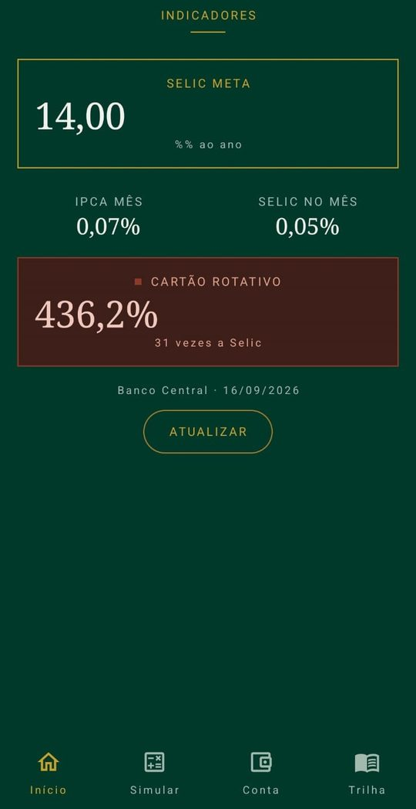

# Bússola

Aplicativo Android nativo de educação financeira. Consome dados oficiais do Banco
Central para mostrar, em reais, o custo de uma dívida e o efeito de poupar.

Projeto em grupo da Fase 1 do 2º ano de Análise e Desenvolvimento de Sistemas,
com tema ESG. Pilar **Social**: inclusão e acesso à educação financeira.

<p align="center">
  
  
  
  
  
  
</p>

## Baixar e testar

O APK está na página de [Releases](../../releases/latest). Baixe o arquivo
`app-release.apk` no celular e permita a instalação de fontes desconhecidas quando
o Android pedir. Funciona a partir do Android 8.0.

A documentação completa do projeto está em [docs/Bussola-Documentacao.pdf](docs/Bussola-Documentacao.pdf).

**Tecnologias:** Kotlin, Jetpack Compose, MVVM, Retrofit, Gson, Coroutines,
DataStore, Navigation Compose e JUnit.

## Equipe

Rafael Macário e colegas de turma.
<!-- Liste aqui o nome (e o GitHub, se quiser) de cada integrante. -->

---

## Como abrir e rodar

1. Abra a pasta `Bussola` no Android Studio (Ladybug ou superior).
2. Na primeira abertura o Studio vai pedir para sincronizar o Gradle. Aceite.
   O projeto usa Gradle 8.9 e AGP 8.7.3, baixados automaticamente.
3. Se o Studio avisar que o `gradle-wrapper.jar` não está presente, use
   **File → Sync Project with Gradle Files**. O Studio recria o wrapper sozinho.
4. Rode em emulador com Android 8.0 (API 26) ou superior, ou em aparelho físico.

O aplicativo precisa de internet apenas para os indicadores. A trilha, o simulador
e o orçamento funcionam offline.

## Como gerar o APK de entrega

1. `Build → Clean Project`, depois `Build → Rebuild Project`.
2. `Build → Generate Signed App Bundle / APK → APK`.
3. `Create new...` para gerar a keystore. **Salve fora da pasta do projeto** e
   anote a senha.
4. Build variant: **release**. Finish.
5. O arquivo sai em `app/release/app-release.apk`.
6. Instale esse APK em um aparelho real e abra antes de entregar. Um release que
   quebra por configuração só aparece testando o release, nunca o debug.

Antes de compactar o projeto, apague `build/`, `app/build/` e `.gradle/`.

## Testes

```
./gradlew test
```

Cobrem a regra financeira (`SimularDividaTest`), o resumo do orçamento
(`ResumoOrcamentoTest`) e o repositório de indicadores contra uma API falsa
(`IndicadoresRepositorioTest`), sem nenhuma chamada de rede real.

---

## Serviço consumido

API SGS do Banco Central, pública, sem cadastro e sem chave de acesso.

```
https://api.bcb.gov.br/dados/serie/bcdata.sgs.{codigo}/dados/ultimos/{n}?formato=json
```

| Código | Série |
|--------|-------|
| 432 | Selic meta (% ao ano) |
| 433 | IPCA: variação mensal (%) |
| 4390 | Selic acumulada no mês (%) |
| 20749 | Juros médios do cartão de crédito rotativo: pessoa física (% ao ano) |

Os códigos estão em um único lugar: o enum `SerieBcb`. Se o Banco Central
renumerar alguma série, é o único arquivo a mudar.

## Arquitetura

Três camadas, com dependência sempre apontando para dentro.

```
ui         → telas Compose e ViewModels (estado e eventos)
dominio    → modelos e regras de negócio, sem Android
dados      → repositórios, API e persistência local
```

- **Estado unidirecional.** Cada tela recebe um único objeto de estado imutável e
  devolve eventos. Não há estado espalhado em variáveis soltas, o que elimina
  combinações inválidas de flags.
- **Repositórios por interface.** `IndicadoresRepositorio`, `OrcamentoRepositorio`
  e `TrilhaRepositorio` são contratos. Trocar a implementação por uma falsa em
  teste é alteração de uma linha.
- **Injeção manual.** `ContainerApp` monta o grafo de dependências. Hilt resolveria
  o mesmo problema, mas para este tamanho adiciona processamento de anotações sem
  benefício proporcional.
- **Regra de negócio isolada.** `SimularDivida` não conhece Android e roda em JVM
  pura, por isso é testável e barata de verificar.
- **Falha é estado, não exceção.** O repositório devolve `Recurso.Sucesso` ou
  `Recurso.Falha`; o ViewModel nunca precisa de try/catch.
- **Chamadas em paralelo.** As quatro séries do Banco Central são independentes e
  vão juntas. Uma série que falhe não derruba o painel inteiro.
- **Cache curto em memória.** Trocar de aba não dispara quatro chamadas de rede.

## Telas

| Tela | Arquivo | O que faz |
|------|---------|-----------|
| Abertura | `ui/abertura/AberturaTela.kt` | Marca e entrada no aplicativo |
| Painel | `ui/painel/PainelTela.kt` | Indicadores reais do Banco Central |
| Simulador | `ui/simulador/SimuladorTela.kt` | Rotativo versus parcelamento |
| Orçamento | `ui/orcamento/OrcamentoTela.kt` | Entradas, saídas e saldo |
| Trilha | `ui/trilha/TrilhaTela.kt` | Cinco módulos com progresso |
| Lição | `ui/licao/LicaoTela.kt` | Conteúdo e quiz |

## Identidade visual

Dois temas completos, claro e escuro, seguindo o sistema. Nenhuma tela tem código
condicional de cor: tudo passa por `MaterialTheme.colorScheme` e por
`LocalCoresBussola`, que carrega o vocabulário próprio da marca (ouro estrutural,
linha, família borgonha).

Semântica fixa das cores: ouro e verde para o que constrói, borgonha para o que
corrói. Nenhuma informação é transmitida apenas por cor: todo bloco de alerta tem
também rótulo e marca de forma.

### Trocar pelas fontes da marca

O projeto usa as famílias serifada e sem serifa do sistema para compilar sem
binários. Para usar as fontes definitivas:

1. Coloque os arquivos `.ttf` em `app/src/main/res/font/`, com nomes em minúsculas
   e underline (ex.: `cormorant_semibold.ttf`, `inter_regular.ttf`).
2. Em `core/ui/tema/Tipografia.kt`, troque as duas constantes:

```kotlin
val FamiliaMostrador = FontFamily(Font(R.font.cormorant_semibold))
val FamiliaTexto = FontFamily(Font(R.font.inter_regular))
```

Nenhum outro arquivo muda.

## Encolhimento de código no release

`isMinifyEnabled` está desligado de propósito. Ligar exige validar as regras de
Retrofit e Gson com o APK assinado em mão, e um release que quebra por regra de
ProGuard é difícil de diagnosticar sob prazo. As regras necessárias já estão
escritas em `app/proguard-rules.pro`. Para ligar, mude para `true` em
`app/build.gradle.kts` e teste o APK assinado em aparelho real antes de entregar.

## Limites conhecidos

- A taxa alternativa do simulador é fixa em 5% ao mês, uma referência conservadora
  de crédito pessoal. Uma versão futura pode buscar a série correspondente na API.
- O orçamento não separa por mês: o resumo considera todos os lançamentos.
- A série 20749 do rotativo deve ser conferida no portal de dados abertos do Banco
  Central antes da apresentação; séries de crédito mudam de numeração.
